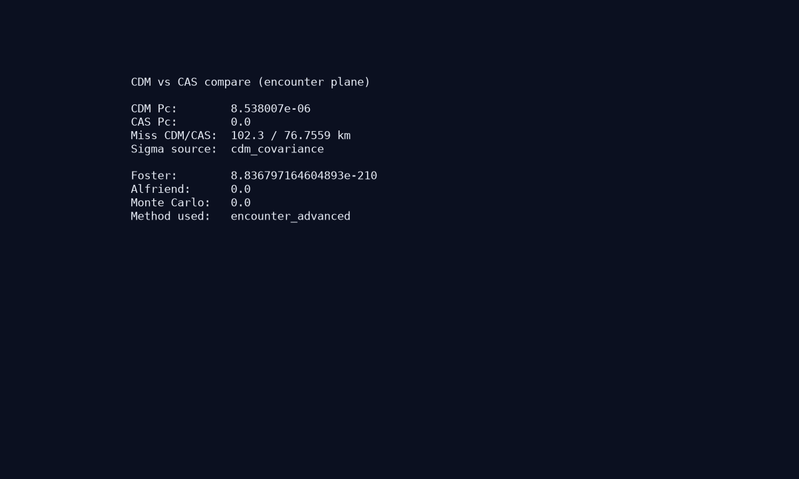

# Conjunction Alert Simulator (CAS)

[](https://github.com/maouM-cmd/conjunction-alert-simulator)
[](LICENSE)
[](https://www.python.org/downloads/)
[](https://github.com/maouM-cmd/conjunction-alert-simulator/actions/workflows/test.yml)
[](https://github.com/maouM-cmd/conjunction-alert-simulator/releases/tag/v1.1.0)


衛星の TLE を入力すると、今後7日間に接近する宇宙デブリを検出し、3D で軌道と最接近点（TCA）を表示し、回避マニューバの効果を試算する Web アプリです。

**v1.1.0（Phase 5）** — Render/Fly クラウド manifest、Slack Webhook、CDM σ on 接近一覧、Advanced Pc デモ素材を追加。Starlink 型の接近監視フローを OSS で再現したポートフォリオ作品です。

## 2 分デモ（推奨）

```powershell
git clone https://github.com/maouM-cmd/conjunction-alert-simulator.git
cd conjunction-alert-simulator
python -m venv venv
venv\Scripts\pip install -r requirements.txt
venv\Scripts\python -m uvicorn backend.app.main:app --host 127.0.0.1 --port 8000
```

1. ブラウザで **http://127.0.0.1:8000/app/** を開く
2. **デモ TLE 読込** → **高精度 Pc** ON → **接近解析**（閾値 50 km）
3. イベントを選択 → 3D 表示 → 回避試算

Docker 代替: `docker compose up --build -d` → http://localhost:8000/app/

## Live Demo（クラウド — 準備中）

Render / Fly.io にデプロイ後、公開 URL の **`/app/`** からそのまま試せます（API は同一オリジン）。**現時点ではローカル / Docker の 2 分デモをご利用ください。**

<!-- デプロイ後に URL を追記 -->
<!-- Live Demo: https://<your-service>.onrender.com/app/ -->

| 方法 | 手順 |
|------|------|
| Render | [deploy-cloud.md](docs/deploy-cloud.md#render) — [`render.yaml`](render.yaml) Blueprint |
| Fly.io | [deploy-cloud.md](docs/deploy-cloud.md#flyio) — [`fly.toml`](fly.toml) |

[](https://render.com/deploy?repo=https://github.com/maouM-cmd/conjunction-alert-simulator)

## 機能

- 自衛星 TLE 入力 → デブリ接近イベント一覧（閾値可変）
- **衝突確率 Pc** — Foster 2D（一覧デフォルト）、opt-in で **Alfriend encounter plane** + **TLE RTN 非等方共分散**
- **Webhook 通知** — 高リスクイベントを Webhook へ POST（generic / Slack Incoming Webhook）
- **CDM σ on 一覧** — `cdm_text` + `apply_cdm_covariance` で接近一覧 Pc に CDM 共分散適用
- **CDM インポート** — RTN 共分散の encounter plane 射影、外部 Pc vs CAS 3方式比較
- **Space-Track CDM アラート** — `cdm_public` 取得、一覧比較、CAS から CDM KVN エクスポート
- **コンステレーション監視** — 最大 25 衛星の TLE 一括接近解析（ProcessPool 並列）
- CesiumJS による 3D 軌道可視化・TCA マーカー・タイムスライダー
- prograde / retrograde / normal 方向の Δv 試算（Before/After）

## 技術スタック

- **Backend:** Python 3.12, FastAPI, SGP4
- **Frontend:** HTML + CesiumJS（ビルド不要）
- **データ:** [CelesTrak](https://celestrak.org/)（デフォルト）/ [Space-Track](https://www.space-track.org/)（オプション）

## Space-Track 連携（オプション）

1. [Space-Track](https://www.space-track.org/auth/createAccount) でアカウント作成
2. `.env.example` を `.env` にコピーして認証情報を設定

```powershell
copy .env.example .env
# SPACE_TRACK_USER / SPACE_TRACK_PASSWORD を編集
# TLE_PROVIDER=spacetrack
```

未設定時は CelesTrak のみ使用。Space-Track 失敗時は CelesTrak に自動フォールバック。

## セットアップ

```powershell
cd C:\Users\admin\OneDrive\ドキュメント\conjunction-alert-simulator
python -m venv venv
venv\Scripts\pip install -r requirements.txt
```

## 起動

```powershell
# API サーバ（プロジェクトルートから）
venv\Scripts\python -m uvicorn backend.app.main:app --reload --host 127.0.0.1 --port 8000

# 別ターミナルで静的フロント（任意）
cd frontend
python -m http.server 8080
```

ブラウザで `http://127.0.0.1:8080` を開く（API は `http://127.0.0.1:8000`）。

FastAPI 経由でフロントも配信する場合は `http://127.0.0.1:8000/app/` を開いてください。

## Docker で起動（Phase 4C）

```powershell
copy .env.example .env   # 任意（Space-Track 利用時は編集）
docker compose up --build -d
```

- UI: **http://localhost:8000/app/**
- ヘルス: `curl http://localhost:8000/health`

詳細は [docs/deploy.md](docs/deploy.md) を参照。

## Webhook 通知（任意）

`.env` に以下を設定:

```env
ALERT_WEBHOOK_URL=https://hooks.slack.com/services/XXX/YYY/ZZZ
ALERT_WEBHOOK_FORMAT=slack
ALERT_PC_THRESHOLD=0.00001
```

解析リクエストで `notify_webhook: true` を指定するか、UI の **Webhook テスト** / `POST /api/v1/alerts/webhook/test` で接続確認。batch 解析でも `notify_webhook` 対応（fleet 一括 POST）。

## CLI（軌道伝播プロトタイプ）

```powershell
venv\Scripts\python -m backend.cli.propagate --tle1 samples/iss.tle --tle2 samples/debris-sample.tle
```

## API 概要

| エンドポイント | メソッド | 概要 |
|---------------|---------|------|
| `/health` | GET | 死活監視 |
| `/api/v1/conjunctions` | POST | 接近イベント検出 |
| `/api/v1/conjunctions/batch` | POST | 複数衛星一括接近解析 |
| `/api/v1/alerts/webhook/test` | POST | Webhook 接続テスト |
| `/api/v1/cdm/parse` | POST | CDM テキスト解析 |
| `/api/v1/cdm/compare` | POST | CDM vs CAS 比較 |
| `/api/v1/cdm/fetch` | POST | Space-Track CDM アラート取得 |
| `/api/v1/cdm/compare-alert` | POST | CDM アラート + TLE 自動比較 |
| `/api/v1/cdm/export` | POST | 接近イベント → CDM KVN |
| `/api/v1/orbit` | POST | 軌道点列（3D 表示用） |
| `/api/v1/maneuver/preview` | POST | 回避マニューバ試算 |

詳細は [docs/api-design.md](docs/api-design.md) を参照。

## ドキュメント

- [要件定義書 Phase 6A](docs/requirements-phase6a.md)
- [GitHub Release 手順](docs/publish-github-release.md)
- [公開チェックリスト v1.1.0](docs/publish-checklist-v1.1.0.md)
- [要件定義書 Phase 1](docs/requirements.md)
- [要件定義書 Phase 2](docs/requirements-phase2.md)
- [要件定義書 Phase 3](docs/requirements-phase3.md)
- [要件定義書 Phase 3.5](docs/requirements-phase35.md)
- [要件定義書 Phase 4A](docs/requirements-phase4a.md)
- [要件定義書 Phase 4A-Ext](docs/requirements-phase4a-ext.md)
- [要件定義書 Phase 4B](docs/requirements-phase4b.md)
- [要件定義書 Phase 4B-Ext](docs/requirements-phase4b-ext.md)
- [要件定義書 Phase 4C](docs/requirements-phase4c.md)
- [要件定義書 Phase 4D](docs/requirements-phase4d.md)
- [要件定義書 Phase 5A](docs/requirements-phase5a.md)
- [要件定義書 Phase 5B](docs/requirements-phase5b.md)
- [要件定義書 Phase 5C](docs/requirements-phase5c.md)
- [要件定義書 Phase 5D](docs/requirements-phase5d.md)
- [クラウドデプロイ](docs/deploy-cloud.md)
- [Zenn 投稿手順](docs/publish-zenn.md)
- [CHANGELOG](CHANGELOG.md)
- [デプロイ手順](docs/deploy.md)
- [API 設計書](docs/api-design.md)
- [アーキテクチャ](docs/architecture.md)

## ライセンス

MIT License — 詳細は [LICENSE](LICENSE)

## 技術記事

| | |
|--|--|
| Zenn | 準備中 — 原稿 [`docs/demo/blog-zenn.md`](docs/demo/blog-zenn.md) / 投稿手順 [`docs/publish-zenn.md`](docs/publish-zenn.md) |
| Release | [v1.1.0 — Phase 5](https://github.com/maouM-cmd/conjunction-alert-simulator/releases/tag/v1.1.0) |
| 公開チェックリスト | [`docs/publish-checklist-v1.1.0.md`](docs/publish-checklist-v1.1.0.md) |

<!-- Zenn 公開後: 上表の Zenn 行を記事 URL に差し替え -->
<!-- 技術記事: https://zenn.dev/... -->

## デモ

| | |
|--|--|
| 初期画面 |  |
| 接近一覧（Advanced Pc） |  |
| 3D 軌道 |  |
| 回避試算 |  |
| CDM 比較 |  |

**UI デモ:** 「デモ TLE 読込」→ **高精度 Pc** ON → 接近解析（閾値 50 km）→ イベント選択 → 3D 表示 → 試算実行

手順: [docs/demo/README.md](docs/demo/README.md) | 技術ブログ: [docs/demo/blog-zenn.md](docs/demo/blog-zenn.md) | Zenn 投稿: [docs/publish-zenn.md](docs/publish-zenn.md)

