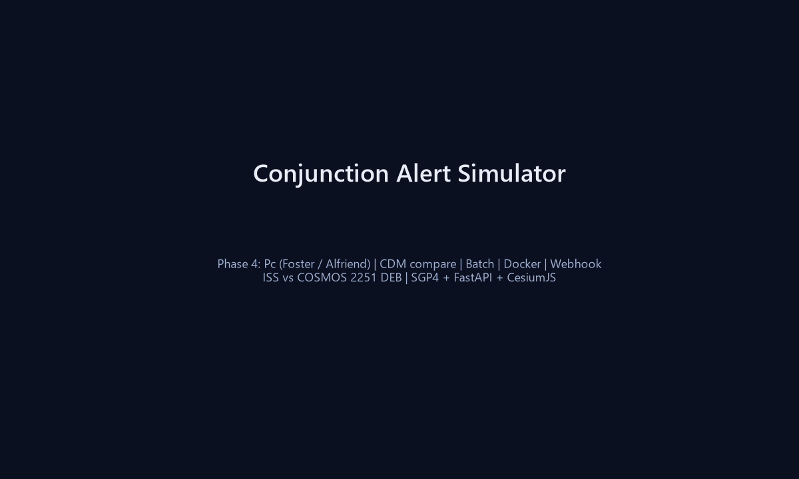
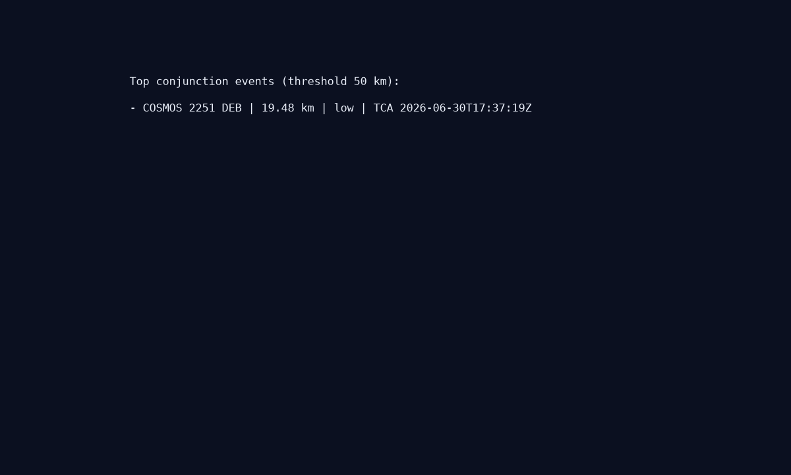
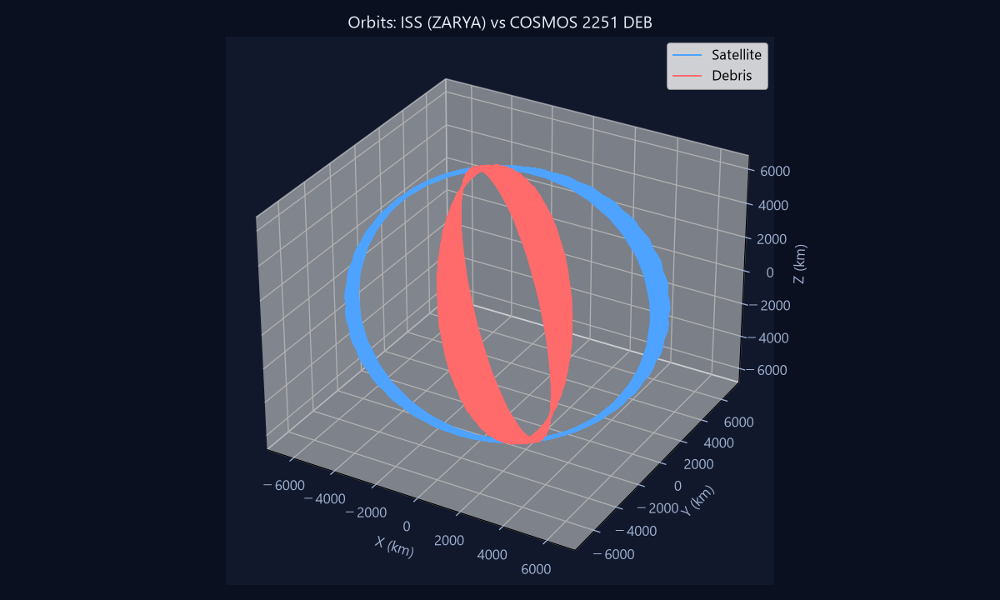
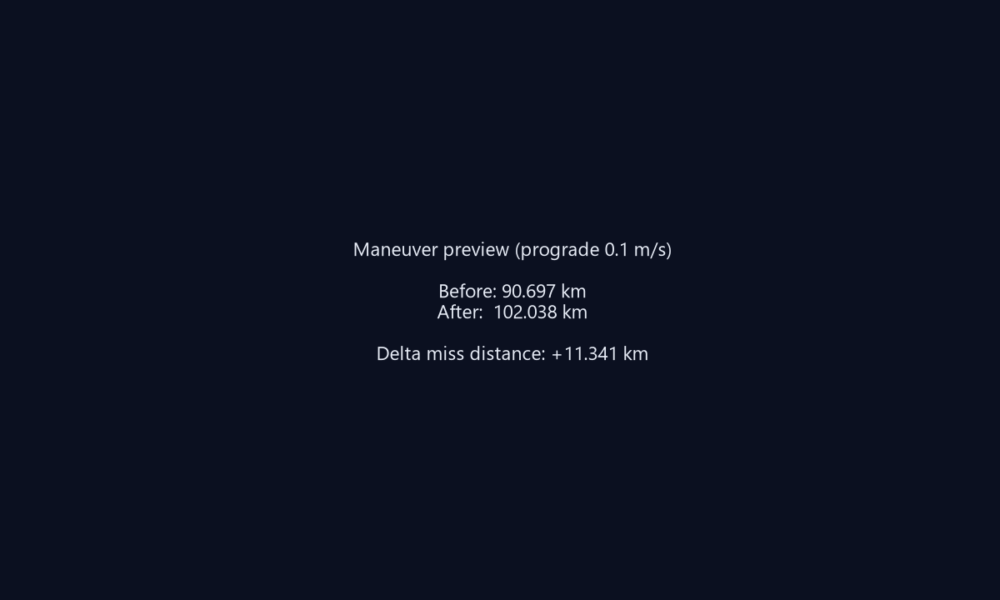

# Conjunction Alert Simulator (CAS)

[](https://github.com/maouM-cmd/conjunction-alert-simulator)


衛星の TLE を入力すると、今後7日間に接近する宇宙デブリを検出し、3D で軌道と最接近点（TCA）を表示し、回避マニューバの効果を試算する Web アプリです。

## 機能

- 自衛星 TLE 入力 → デブリ接近イベント一覧（閾値可変）
- **衝突確率 Pc** — Foster 2D（一覧デフォルト）、opt-in で **Alfriend encounter plane**（一覧・batch）、CDM 比較では **Alfriend + Monte Carlo**
- **CDM インポート** — RTN 共分散の encounter plane 射影、外部 Pc vs CAS 3方式比較
- **Space-Track CDM アラート** — `cdm_public` 取得、一覧比較、CAS から CDM KVN エクスポート
- **コンステレーション監視** — 最大 25 衛星の TLE 一括接近解析（ProcessPool 並列）
- CesiumJS による 3D 軌道可視化・TCA マーカー・タイムスライダー
- prograde / retrograde / normal 方向の Δv 試算（Before/After）

## 技術スタック

- **Backend:** Python 3.12, FastAPI, SGP4
- **Frontend:** HTML + CesiumJS（ビルド不要）
- **データ:** [CelesTrak](https://celestrak.org/)（デフォルト）/ [Space-Track](https://www.space-track.org/)（オプション）

## Space-Track 連携（オプション）

1. [Space-Track](https://www.space-track.org/auth/createAccount) でアカウント作成
2. `.env.example` を `.env` にコピーして認証情報を設定

```powershell
copy .env.example .env
# SPACE_TRACK_USER / SPACE_TRACK_PASSWORD を編集
# TLE_PROVIDER=spacetrack
```

未設定時は CelesTrak のみ使用。Space-Track 失敗時は CelesTrak に自動フォールバック。

## セットアップ

```powershell
cd C:\Users\admin\OneDrive\ドキュメント\conjunction-alert-simulator
python -m venv venv
venv\Scripts\pip install -r requirements.txt
```

## 起動

```powershell
# API サーバ（プロジェクトルートから）
venv\Scripts\python -m uvicorn backend.app.main:app --reload --host 127.0.0.1 --port 8000

# 別ターミナルで静的フロント（任意）
cd frontend
python -m http.server 8080
```

ブラウザで `http://127.0.0.1:8080` を開く（API は `http://127.0.0.1:8000`）。

FastAPI 経由でフロントも配信する場合は `http://127.0.0.1:8000/app/` を開いてください。

## CLI（軌道伝播プロトタイプ）

```powershell
venv\Scripts\python -m backend.cli.propagate --tle1 samples/iss.tle --tle2 samples/debris-sample.tle
```

## API 概要

| エンドポイント | メソッド | 概要 |
|---------------|---------|------|
| `/health` | GET | 死活監視 |
| `/api/v1/conjunctions` | POST | 接近イベント検出 |
| `/api/v1/conjunctions/batch` | POST | 複数衛星一括接近解析 |
| `/api/v1/cdm/parse` | POST | CDM テキスト解析 |
| `/api/v1/cdm/compare` | POST | CDM vs CAS 比較 |
| `/api/v1/cdm/fetch` | POST | Space-Track CDM アラート取得 |
| `/api/v1/cdm/compare-alert` | POST | CDM アラート + TLE 自動比較 |
| `/api/v1/cdm/export` | POST | 接近イベント → CDM KVN |
| `/api/v1/orbit` | POST | 軌道点列（3D 表示用） |
| `/api/v1/maneuver/preview` | POST | 回避マニューバ試算 |

詳細は [docs/api-design.md](docs/api-design.md) を参照。

## ドキュメント

- [要件定義書 Phase 1](docs/requirements.md)
- [要件定義書 Phase 2](docs/requirements-phase2.md)
- [要件定義書 Phase 3](docs/requirements-phase3.md)
- [要件定義書 Phase 3.5](docs/requirements-phase35.md)
- [要件定義書 Phase 4A](docs/requirements-phase4a.md)
- [要件定義書 Phase 4A-Ext](docs/requirements-phase4a-ext.md)
- [要件定義書 Phase 4B](docs/requirements-phase4b.md)
- [API 設計書](docs/api-design.md)
- [アーキテクチャ](docs/architecture.md)

## ライセンス

MIT License — 詳細は [LICENSE](LICENSE)

## デモ

| | |
|--|--|
| 初期画面 |  |
| 接近一覧 |  |
| 3D 軌道 |  |
| 回避試算 |  |

**UI デモ:** 「デモ TLE 読込」→ 接近解析（閾値 50 km）→ イベント選択 → 3D 表示 → 試算実行

手順: [docs/demo/README.md](docs/demo/README.md) | 技術ブログ: [docs/demo/blog-draft.md](docs/demo/blog-draft.md)
