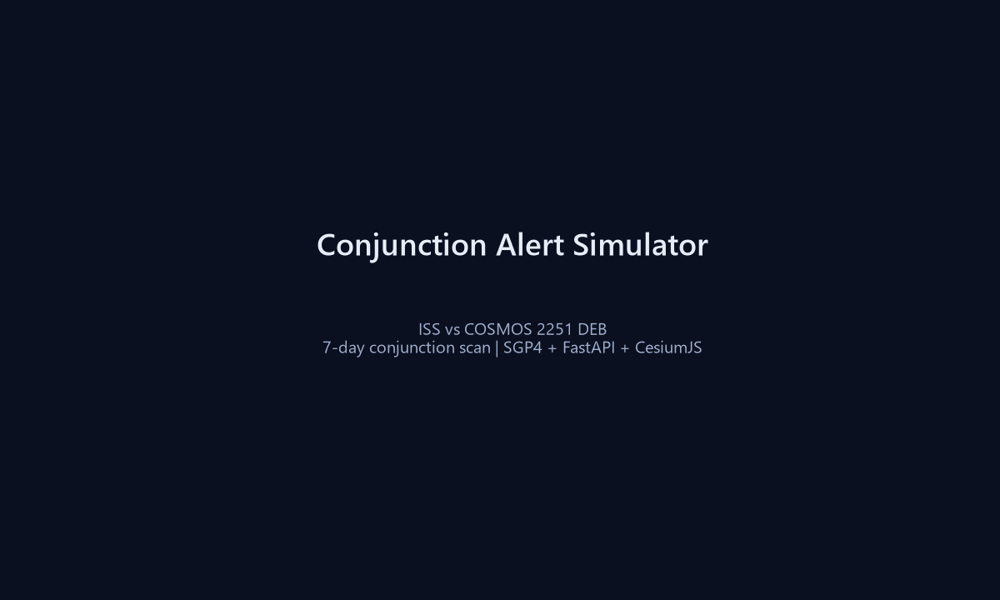

# Conjunction Alert Simulator を作った — 軌道力学と衝突回避の縮小版

**公開リポ:** https://github.com/maouM-cmd/conjunction-alert-simulator

低軌道衛星と宇宙デブリの接近（Conjunction）は、Starlink のような大規模コンステレーション運用では毎日の課題です。本番システムは Space-Track や衝突確率 Pc など高度な要素を含みますが、**TLE + SGP4 + 最接近距離** だけでもアラートの流れは学べます。

今回 OSS 公開した **Conjunction Alert Simulator（CAS）** の要点をまとめます。



## できること

- 自衛星 TLE 入力 → 7 日間のデブリ接近イベント検出
- CesiumJS 3D 可視化（衛星・デブリ軌道、TCA マーカー）
- prograde / retrograde / normal の Δv 試算（Before/After）

## 技術スタック

| レイヤ | 選定 |
|--------|------|
| 軌道伝播 | SGP4（`sgp4`） |
| API | FastAPI + Pydantic |
| 3D | CesiumJS |
| データ | CelesTrak デブリ TLE（24h キャッシュ） |

## 性能の工夫

デブリ数千件 × 7 日 × 1 分刻みは重いため、**衛星平均高度 ±200 km** のプレフィルタを `analysis.py` に実装しました。

## デモ

ISS では 5 km 閾値でイベント 0 件になりがちなので、CLI で最接近ペアを自動生成し UI に **デモ TLE 読込** ボタンを追加しています。

```powershell
venv\Scripts\python -m backend.cli.find_demo_pair
```

## 起動

```powershell
git clone https://github.com/maouM-cmd/conjunction-alert-simulator.git
cd conjunction-alert-simulator
venv\Scripts\pip install -r requirements.txt
venv\Scripts\python -m uvicorn backend.app.main:app --host 127.0.0.1 --port 8000
```

→ http://127.0.0.1:8000/app/

## Phase 2 予定

- Pc 計算（Foster 公式）
- Space-Track 連携

MIT License。フィードバックは GitHub Issues へ。
